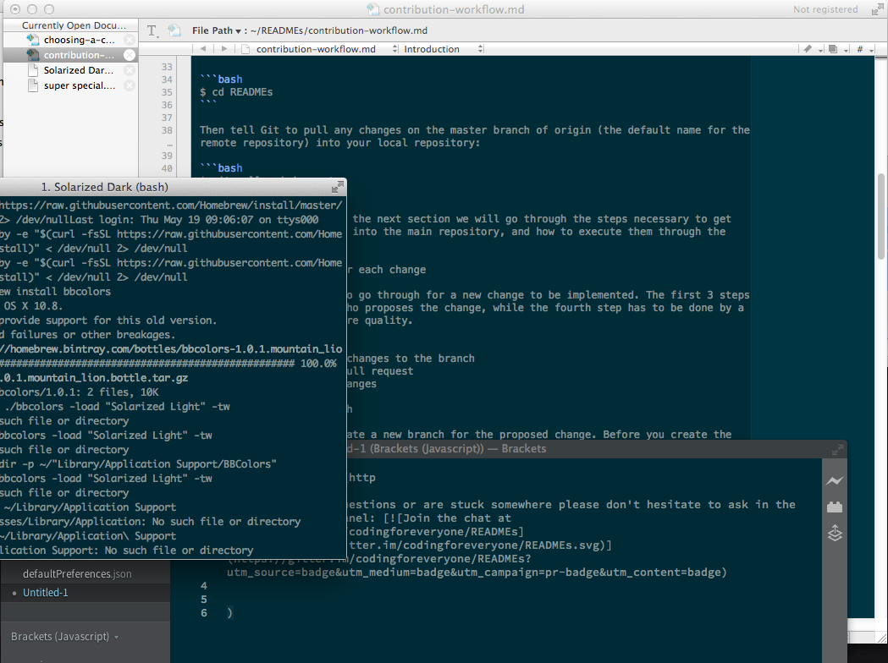

Inspired by http://ethanschoonover.com/solarized. Adapted from https://gist.github.com/dgoppenheimer/d58dbc7bd9170f1b1a5d. Tested on MacOSX 10.8.5.

<b>**Installation:**</b>

Place file in <i>~/Library/Application\ Support/TextWrangler/Color\ Schemes</i>

Restart application. Preferences > Text Colors > Color Scheme (drop down menu) and select Solarized Dark. 

